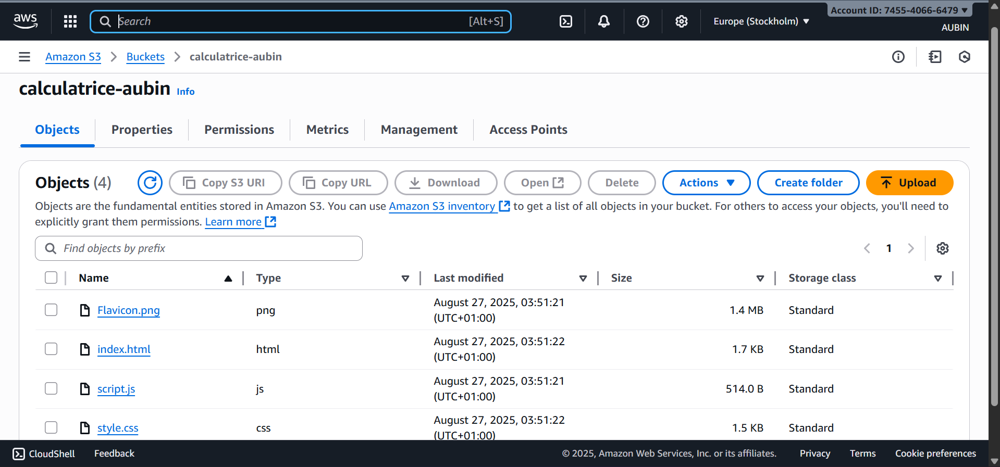

# aws-s3-static-calculator-Educloud-Defi5

*Theme* : Creation d'application web statique et herbergement sur le cloud via AWS S3  
Apprendre → Construire → Partager → Gagner  

## Lien vers l'application en ligne
*Lien vers l'application en ligne* : http://calculatrice-aubin.s3-website.eu-north-1.amazonaws.com

##  Captures d'écran  

|  |  |  | 

##  Outils utilisés 
- *Langage* : Python, CSS3 & JavaScript 
- *AWS* : AWS S3  
- *Github* 

##  Réflexion personnelle  

Ce défi m’a permis de découvrir l’hébergement statique avec AWS S3, de comprendre comment rendre un site accessible depuis le cloud et de mieux organiser mes fichiers web. Une belle étape pour progresser vers le DevOps et le cloud moderne.

## Challenge organisé par

[@Educloud Academy](https://www.linkedin.com/company/educloud-academy/) dans le cadre du programme *“Apprendre → Construire → Partager → Gagner”*.

